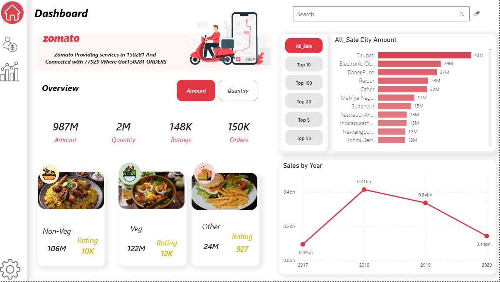
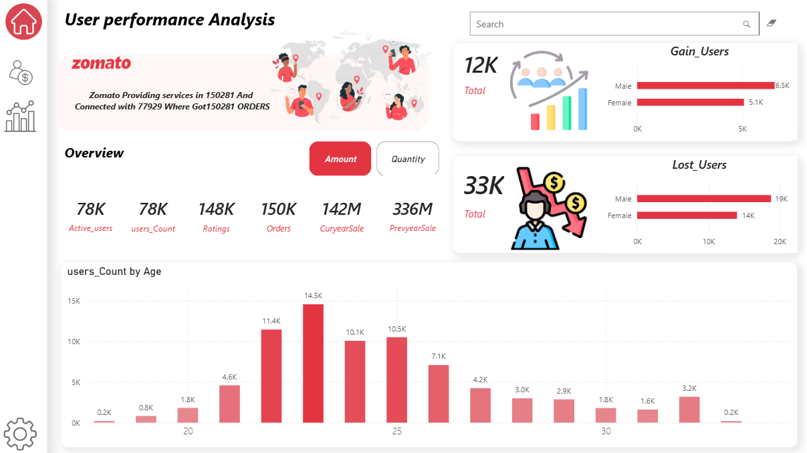
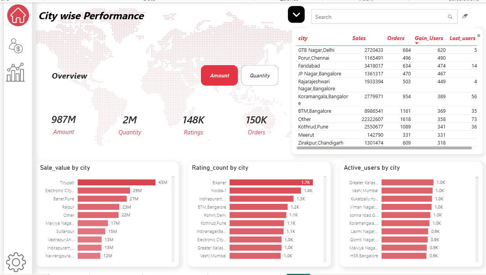

#  Vikas Dhakad
# 🍽 Zomato Performance Dashboard

This project presents a detailed visual analysis of Zomato's performance across various dimensions such as sales, user engagement, and city-wise performance. It was created as part of a data analytics and visualization learning journey.

## 📌 Overview

The dashboard includes insights into:
- Total orders and sales
- Ratings and user feedback
- City-wise sales performance
- Gain/Loss in users
- Age-wise user demographics

---

## 🖼 Dashboard Home

This is the landing screen of the Zomato dashboard. It provides a visually rich and vibrant interface to showcase the data insights and includes navigation to different sections like Overview, User Analysis, and City Performance.

---

## 📊 General Overview

- **Total Sales:** 987M  
- **Orders:** 150K  
- **Ratings:** 148K  
- Highlights food category performance (Veg, Non-Veg, and Others)
- Displays top city-wise sales and year-on-year trends from 2017 to 2020

---

## 👥 User Performance Analysis

- Gain Users: 12K  
- Lost Users: 33K  
- Gender distribution and age-wise user count
- Compared current year sales (142M) with previous year (336M)
- Identifies user retention challenges and demographic behavior

---

## 🌍 City-wise Performance

- Displays top performing cities in terms of:
  - Sales value
  - Ratings
  - Active users
- A data table showing individual city-wise performance including gain/loss in users
- Top cities: Tirupati, Electronic City, Baner Pune

---

## 🙏 Special Thanks

A heartfelt **thank you to my mentor [Sandeep Sappal Sir]** for his continuous guidance and support throughout this project. His mentorship helped me navigate challenges and enhance my analytical thinking.

---

## 🧰 Tools Used

- Power BI / Excel / Tableau *(update accordingly)*
- Data Cleaning
- DAX / Formulas
- Data Visualization

---

## 📬 Contact

**Vikas Dhakad**  
[LinkedIn](https://www.linkedin.com/) *(https://www.linkedin.com/in/vikas-dhakad-1b5472223/)*  

---

> ⭐ *If you found this helpful, please give this repo a star!*

